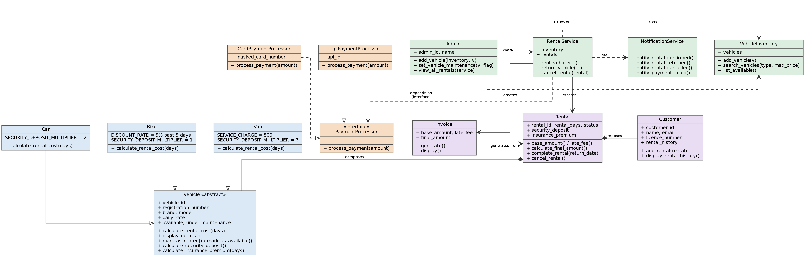

# Vehicle Rental Management System

A console-based OOP case study in Python. The system lets a rental
company manage a fleet of cars, bikes, and vans; register customers;
run the full rent → return → invoice workflow; and process payment
through a swappable interface rather than a hard-coded payment type.

Two ways to run it:
- `main.py` — a scripted run of the mandatory demonstration scenario (deterministic, reproducible)
- `interactive_main.py` — a real interactive console menu built on the exact same classes, for hands-on use

## Class diagram



Hollow triangle = inheritance. Dashed hollow triangle = interface
realization. Filled diamond = composition. Dashed arrow = dependency
(the class depends on an abstraction, not a concrete implementation).

## Project structure

```
vehicle_rental_system/
├── models/
│   ├── vehicle.py       Vehicle (abstract), Car, Bike, Van
│   ├── customer.py      Customer
│   ├── rental.py        Rental
│   ├── invoice.py       Invoice
│   └── admin.py         Admin
├── payments/
│   ├── payment_processor.py   PaymentProcessor interface
│   ├── card_payment.py        CardPaymentProcessor
│   └── upi_payment.py         UpiPaymentProcessor
├── services/
│   ├── vehicle_inventory.py     VehicleInventory
│   ├── rental_service.py        RentalService (the orchestrator)
│   └── notification_service.py  NotificationService
├── exceptions/
│   └── rental_exceptions.py    Custom exception hierarchy
├── persistence/
│   └── data_store.py           JSON save/load
├── tests/
│   └── test_rental_system.py   25 automated unit tests
├── docs/
│   └── class_diagram.png
├── data/                        generated at runtime (vehicles.json, customers.json)
├── main.py                      scripted mandatory demo scenario
├── interactive_main.py          interactive console menu
├── requirements.txt
└── README.md
```

## Class responsibilities

| Class | Responsibility |
|---|---|
| `Vehicle` (abstract) | Shared fields (id, registration, brand, model, rate, availability) + abstract `calculate_rental_cost()` |
| `Car` / `Bike` / `Van` | Each implements its own pricing rule |
| `Customer` | Identity, validation, rental history |
| `Admin` | Manages inventory and vehicle maintenance status  |
| `PaymentProcessor` (interface) | The one contract: `process_payment(amount)` |
| `CardPaymentProcessor` / `UpiPaymentProcessor` | Two independent implementations of the contract |
| `Rental` | Composes a Customer + Vehicle; enforces rental business rules |
| `Invoice` | Formats and displays the final billing breakdown |
| `VehicleInventory` | Owns the vehicle list; search and availability |
| `RentalService` | Orchestrates rent/return/cancel; depends only on `PaymentProcessor`, `VehicleInventory`, and `NotificationService` — never a concrete payment or vehicle class |
| `NotificationService` | Simulates SMS/email notifications at rental, return, and cancellation  |

## OOP concept mapping

- **Encapsulation** — every model class stores fields as `self.__field` (name-mangled private), exposed only through read-only `@property` getters. Validation happens in `__init__`, so an invalid object can never exist.
- **Abstraction** — `Vehicle` and `PaymentProcessor` are both `ABC` subclasses with `@abstractmethod` methods; neither can be instantiated directly.
- **Inheritance** — `Car`, `Bike`, `Van` all extend `Vehicle`.
- **Polymorphism** — `calculate_rental_cost(days)` and `calculate_security_deposit()` behave differently per subclass with zero `if vehicle_type == ...` conditionals anywhere in the codebase. See "Where polymorphism is used" below.
- **Interface** — `PaymentProcessor` (an ABC with one abstract method) is implemented independently by `CardPaymentProcessor` and `UpiPaymentProcessor`. `RentalService` only ever calls `payment_processor.process_payment(...)` — it never imports or checks for a concrete payment class.
- **Method overriding** — every subclass of `Vehicle` overrides `calculate_rental_cost()`.
- **Method overloading** — Python has no true overloading, so `VehicleInventory.search_vehicles(vehicle_type=None, max_price=None)` uses optional keyword arguments to search by type, price, or both from a single method.
- **Composition** — `Rental` holds references to a `Customer` and a `Vehicle` (HAS-A, not IS-A); `Invoice` holds a reference to the `Rental` it bills.
- **Dependency inversion** — `RentalService` is constructed with an optional `NotificationService` and takes any `PaymentProcessor` at call time — it's wired against abstractions, never a concrete class.
- **Exception handling** — a `RentalException` base class with specific subclasses (`ValidationError`, `VehicleUnavailableError`, `InvalidRentalDurationError`, `PaymentFailureError`, `VehicleUnderMaintenanceError`, `InvalidOperationError`), each raised with a meaningful message and caught where the workflow needs to react to it.

## Where polymorphism is used, and why it matters

`RentalService.rent_vehicle()` calls `vehicle.calculate_rental_cost(days)` on
whatever `Vehicle` it's handed — it has no idea whether that's a `Car`,
`Bike`, or `Van`, and it doesn't need to. Each subclass supplies its own
pricing logic, so the calling code stays completely unaware of vehicle
types. This is what satisfies -  no long if/else chains based on vehicle type": there's no vehicle-type
conditional anywhere in the codebase, because the vehicle itself is
responsible for knowing its own cost. It's also what makes the system
open to extension — adding a `Truck(Vehicle)` class with its own pricing
rule requires touching exactly one file (`models/vehicle.py`); nothing
in `services/` or `main.py` changes.

## Other implemented features

- Security deposit + insurance premium calculation (per-vehicle-type deposit multiplier)
- Cancellation and refund handling (with a cancellation fee)
- Maintenance status that blocks a vehicle from being rented
- Administrator role, separate from Customer (not a subclass — different responsibilities)
- JSON-based data persistence for vehicles and customers
- Automated unit tests (25 tests, success and failure paths) and simulated notifications (SMS/email messages printed at rental, return, and cancellation)
- A fully interactive console menu (`interactive_main.py`), reusing every existing class with zero modification — demonstrating the design is genuinely extensible

## Run instructions

```bash
python -m venv venv
venv\Scripts\activate
pip install -r requirements.txt
python main.py               # scripted demo scenario
python interactive_main.py   # interactive console menu
```

## Run tests

```bash
python -m pytest -v
```

25 tests covering polymorphic cost calculation, validation failure
paths, business rules (unavailable vehicle, maintenance block, late
fees, cancellation), and the payment interface (both a succeeding and
a failing `PaymentProcessor` implementation, proving `RentalService`
depends only on the interface).